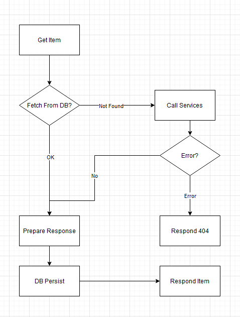
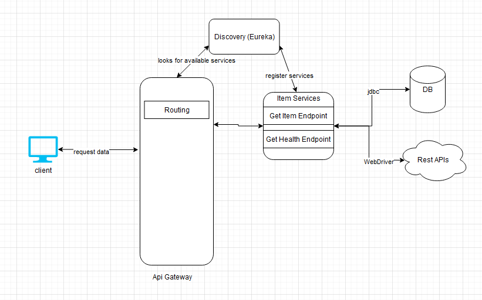

# MeLi Challenge

This project exposes two endpoints:

 ### Item
 .../items/{id}
 Get info from two APIS from MercadoLibre and merge the data into a new entity
 ### Health
 .../health
Get the metrics related to the http incoming and outcoming processes on the service server

## Local Start Process
Set the following env variables:
HOST - db host
PORT - db port
USER - db username
PASS - db password
SCHEMA - db schema

An example .env file is in the root directory.

In the challenge directory there is a init.sql file to set up the database

## Start app with Docker 
I could not integrate all the services in one single Dockerfile

## Strategy

### Fetch Data

### Database Model

### Components

-   Discovery server
-   Api Gateway
-   Item Service

### Technologies
 - Java 8
 - Maven
 - Spring (Cloud, Data, Actuator, Webflux)
 - Eureka
 - Postgres

## Improvements that could be done
  - Implement a cache to know if the item is in the DB to avoid unnecesary DB connections, in case of elastic scalability it's necessary to use a set of coordinated external caches
  - Implement a load balancer like Zuul
  - Implement some monitoring tool to improve the performance and capacity of the health task like Prometheus
  - Implement a queue and a service to separate the persist the data task
  - Add a API documentation generator like Swagger
  - User kubernetes to package the application into a Pod

